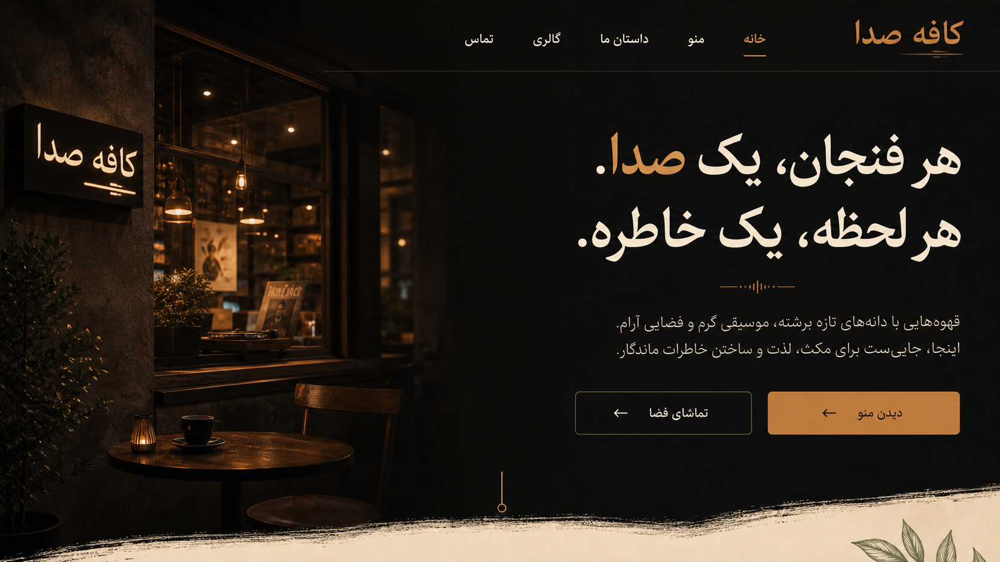

# کافه صدا

وب‌سایت رسمی و سامانه مدیریت محتوای «کافه صدا»؛ یک تجربه فارسی، سریع و واکنش‌گرا برای نمایش منوی کامل، داستان برند، گالری تصویر و ویدیو و اطلاعات تماس کافه.



## امکانات اصلی

- صفحه عمومی کاملاً فارسی و RTL با طراحی اختصاصی، واکنش‌گرا و دسترس‌پذیر
- منوی دسته‌بندی‌شده با قیمت، توضیح، وضعیت موجودی و فیلتر تعاملی
- گالری حرفه‌ای برای تصویر و ویدیو، نمایش تمام‌صفحه و کنترل پخش
- پنل مدیریت امن برای مدیریت آیتم‌های منو، دسته‌بندی‌ها، رسانه‌ها، متن‌های سایت و SEO
- بهینه‌سازی خودکار تصاویر بارگذاری‌شده به WebP و محدودیت امن حجم فایل
- SEO فنی شامل متادیتای پویا، Open Graph، داده ساختاریافته `CafeOrCoffeeShop`، `robots.txt` و `sitemap.xml`
- احراز هویت با کوکی `HttpOnly`، هش رمز عبور، محدودسازی تلاش ورود، CSP و هدرهای امنیتی
- استقرار قابل تکرار با Docker Compose، Health Check، Volume پایدار و Reverse Proxy در Nginx
- محتوای اولیه کامل و تصاویر اختصاصی تولیدشده برای برند کافه صدا

## دسترسی آزمایشی

| بخش | مسیر | اطلاعات ورود |
|---|---|---|
| سایت عمومی | `/` | بدون نیاز به ورود |
| پنل مدیریت | `/admin` | نام کاربری `admin` — رمز `admin123` |
| بررسی سلامت | `/health` | خروجی JSON |

> این مشخصات برای محیط آزمایشی درخواستی تنظیم شده‌اند. پیش از انتشار عمومی، `ADMIN_PASSWORD` و `JWT_SECRET` را در فایل `.env` تغییر دهید.

## معماری

```text
مرورگر
  └── Nginx (پورت 80/443)
       └── Node.js / Express (پورت داخلی 3000)
            ├── React + Vite (فایل‌های استاتیک)
            ├── REST API (/api)
            ├── محتوای پایدار JSON (Docker volume)
            └── رسانه‌های آپلودشده (Docker volume)
```

این معماری برای یک کافه مستقل سبک، قابل‌پشتیبانی و کم‌هزینه است. ذخیره‌سازی فایل‌محور با نوشتن اتمیک انجام می‌شود و برای بار معمول یک سایت کافه مناسب است. در صورت رشد به چند شعبه، چند مدیر هم‌زمان یا گزارش‌گیری پیچیده، لایه ذخیره‌سازی را می‌توان بدون تغییر رابط کاربری به PostgreSQL منتقل کرد.

## شروع سریع توسعه

نیازمندی‌ها: Node.js نسخه ۲۰ یا بالاتر و npm.

```bash
cp .env.example .env
npm ci
npm run dev
```

- سایت توسعه: `http://localhost:5173`
- API: `http://localhost:3000`
- پنل مدیریت: `http://localhost:5173/admin`

برای بررسی کامل:

```bash
npm run check
```

## ساختار پروژه

```text
client/
  public/assets/       تصاویر اولیه و فایل‌های عمومی
  src/components/      اجزای سایت عمومی
  src/pages/           صفحات عمومی، ورود و مدیریت
  src/styles/          توکن‌ها و استایل‌های عمومی/مدیریت
server/
  data/seed.json       محتوای اولیه نسخه‌بندی‌شده
  src/                 API، احراز هویت، ذخیره‌سازی و SEO
  uploads/             محل رسانه‌های آپلودشده در توسعه
docs/design/           مراجع بصری تأییدشده برای توسعه آینده
nginx/                 پیکربندی Reverse Proxy
Dockerfile             ایمیج چندمرحله‌ای Production
docker-compose.yml     سرویس، Volumeها و Health Check
```

## اسناد

- [راهنمای توسعه](development.md): قراردادهای کد، API، مدل محتوا، تست و افزودن قابلیت
- [راهنمای استقرار](deployment.md): نصب روی Ubuntu، Nginx، پشتیبان‌گیری، به‌روزرسانی و بازگردانی

## پشتیبانی و نگهداری

در گزارش خطا این اطلاعات را ثبت کنید: مسیر صفحه، زمان تقریبی، مرورگر/دستگاه، اقدام انجام‌شده، نتیجه مورد انتظار و بخش مرتبط از لاگ `docker compose logs`. اطلاعات محرمانه، رمز عبور یا محتوای کوکی را در Issue قرار ندهید.

برای تغییرات آینده، ابتدا `npm run check` را اجرا کنید، سپس نسخه Docker را در محیط آزمایشی بسازید و بعد از Health Check و Smoke Test، انتشار انجام دهید.

